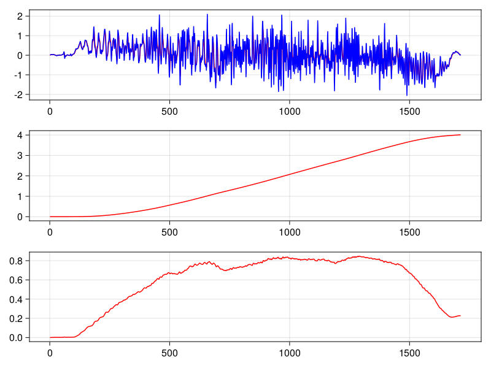

# 卡尔曼滤波实现
matlab程序和数据是用B站 https://www.bilibili.com/video/BV1Mr4y1X7D3/?share_source=copy_web&vd_source=13e177b51d50073b919e529ede944608 。  
C程序是自己改写，可以移植到嵌入式，不同的问题只需要改变状态矩阵A。

图中分别是加速度滤波效果、加速度估计位移、加速度估计的速度：

